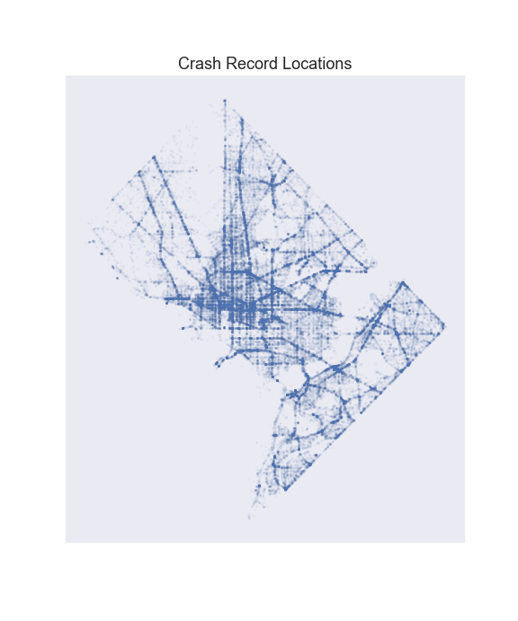
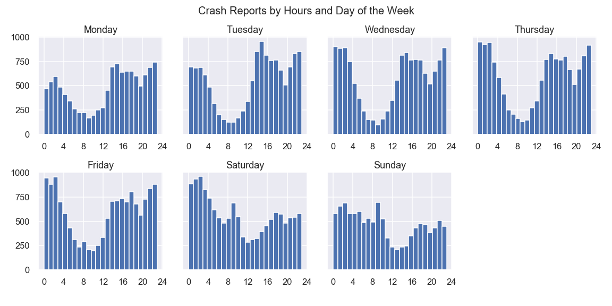
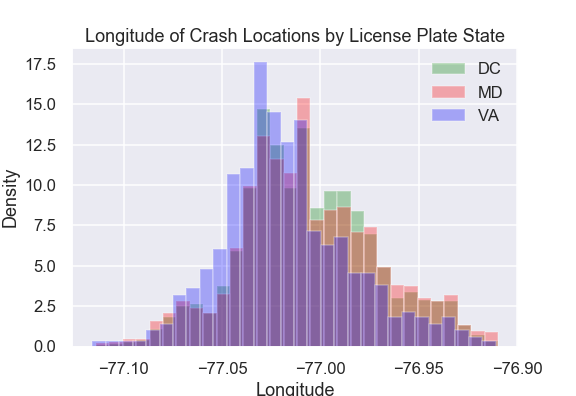
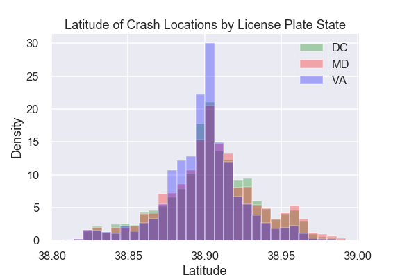
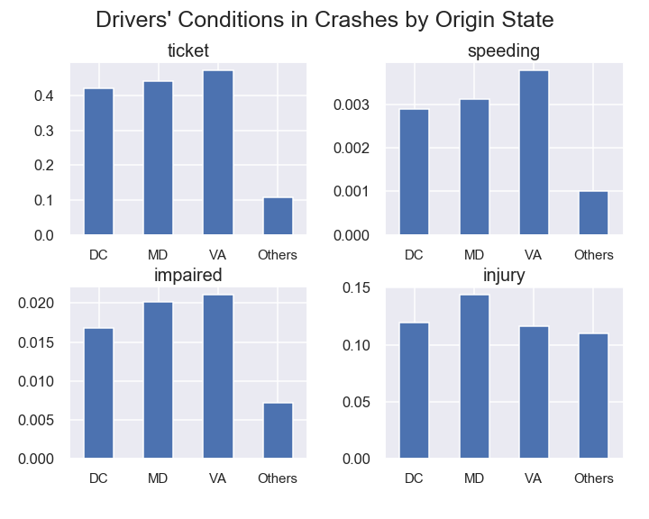
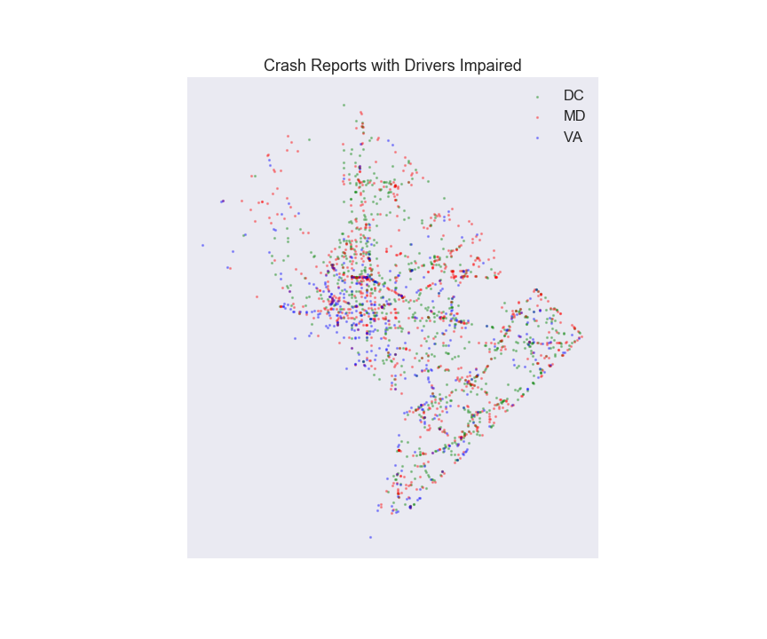

# Analysis of Crash Reports in DC

## Objectives
We analyze crash reports in DC in the past four years (i.e. 2016 to 2019.) Questions to be asked include trends of crashes  hours (e.g. morning vs evening), days of the week (weekdays vs weekends),  and geographical locations.

## Contributors
Anthony Schams and Keita Miyaki

## Datasets
We looked at "Crashes in DC" and "Crash Details Table" datasets from the DC Government ([link](https://opendata.dc.gov)). Both datasets provide records of crashes within the District of Columbia from 1975 to June 2019.

### Data cleaning
"Crashes in DC" dataset provides ~211,000 incidents, of which abnormal number, close to half of the entire observations are reported exactly at five o'clock in the morning. We assume those record as inproper reporting and thus drop them.

After removing five am reports, we see that 2016-2019 are the only years that appear to be 'complete.' Years prior to 2016 have much low numbers, less than half of 2016, of crashes; we believe that many of the reports in earlier years were recorded with times of 5 am and were dropped. For the incomplete information we have for years prior to 2016, we will limit our analysis to the years 2016-2019.

This clearning process yielded ~91,000 observations.

"Crash Details Table" contains information about parties (e.g. drivers) involved in crashes, and records can be associated with the observations in "Crashs in DC" dataset with "CRASHID" key (renamed as "CRIMEID" in the CSV file). We looked at records in "Crash Details Table" which correspond to filtered observations above.

Of ~460,000 records in the original dataset, we ended up using ~166,000 records. It means that average 1.82 parties are involved in each crash in the universe we analyze.

### General description of the data

While crashes take place all over the district, we clearly find high frequency of crashes along major routes including interstate highways. We also see larger number of incidents in the downtown area in NW.

Weekdays and weekends entail slightly different trends. On weekdays the number of crashes declines in the morning with the bottom around 8 to 11 in the morning. After an increase in the afternoon, weekdays have the second and smaller bottom on dinner time around 8 pm.

In contrast, on weekends, we see a peak in crashes in the morning around 9 to 10 am. The number of crashes declines until noon to 2 pm. It increases again toward the evening but less steeply than on weekdays.

## Presentation
[Presentation slides can be found here](https://docs.google.com/presentation/d/12JJX41uhhgftvM0FsBUGCVV4-NYXm8TlZeUbgdCAurc/edit?usp=sharing)

## Questions
- Is there a difference between Monday and Friday w.r.t number of crashes?
-- Does this change with respect to time of day? 
- Does Friday’s evening rush hour have more crashes than other days’ rush hour?
- Is the morning or evening more safe for pedestrians?
- Do DC, VA, and MD drivers behave differently? 

## Analysis

### Is there a difference between Monday and Friday w.r.t number of crashes?

#### Does this change with respect to time of day? 

### Does Friday’s evening rush hour have more crashes than other days’ rush hour?

### Is the morning or evening more safe for pedestrians?

### Do DC, VA, and MD drivers behave differently? 

We look at the license plates, and analyze the trends of drivers from DC, Maryland, and Virginia.

#### Geographical locations of crashes

It is natural to assume that drivers from neighboring states (i.e. Maryland and Virginia) crash more often near the borders to their home states. We look at the locations of crashes by drivers' origin and find different distributions of crash records along the longitude and latitude.

Locations of crashes involving Virginia drivers are tilted toward west, and its mean longitude is statistically different from those of DC and Maryland drivers. The locations of DC and Maryland drivers overlap and their mean longitudes are not significantly different from each other.

Likewise, crashes by Virginia drivers are slanted to South, while Marylanders have crashes in north more likely than others. Mean latitudes for the district and two neighbor states are different from each other with statistic significanse.

#### Driver behaviors

Average conditions of drivers vary by states of origin. In the United States, it is common to hear complaints from a driver about drivers from an adjacent state. We find some evidences to support some of the claims.

- DC drivers in crashes receive less tickets than Maryland and Virginia drivers, and Maryland drivers get less tickets than Virginia drivers. In contrast we do not see significant difference in speeding
- Drivers with DC license plates in crashes are less likely to be found impaired. We assume that some drivers from Maryland and Virginia drive back home after consuming alcohol, marijuana, or other drugs and have crashes
- DC and Virginia drivers in crashes are less likely to get injured than Maryland drivers. It is puzzling that Virginia drivers tend to be riskier drivers but less likely to get injured

##### Supporting data about driver impairment

Early morning time on weekend is the peak for crashes involving impaired driveres. It is clear that people consume alcohol, marijuana, or other drugs on Friday/Saturday night, and on the way back they have crashes.

On the map, we see high concentration of crashes with impaired drivers in the downtown area, especially around U street and DuPont Circle neighborhoods.

